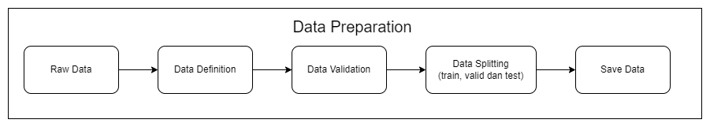
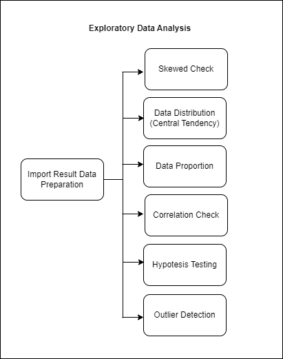
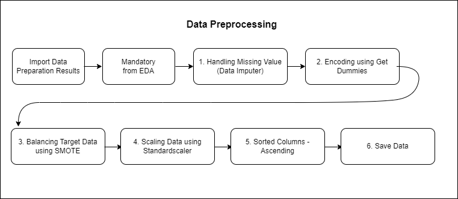
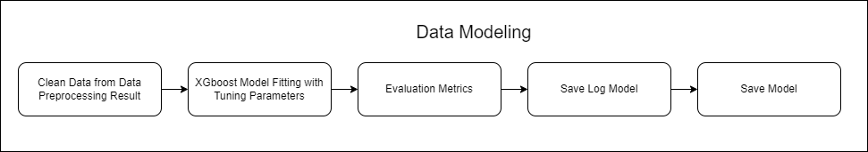
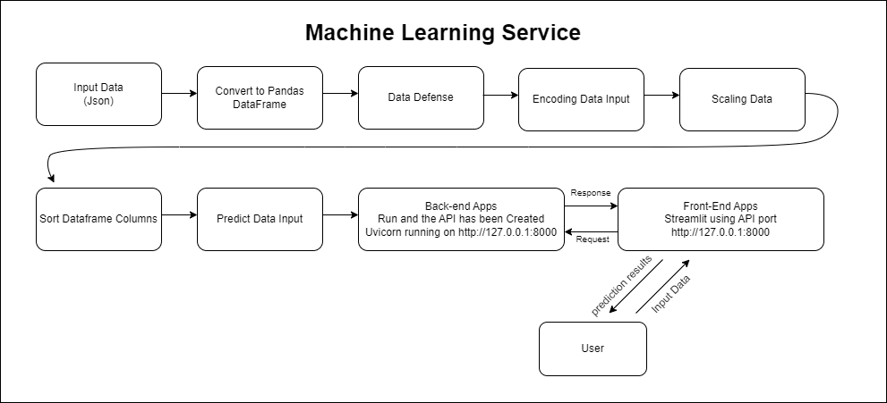
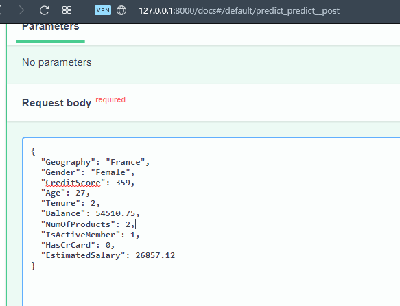
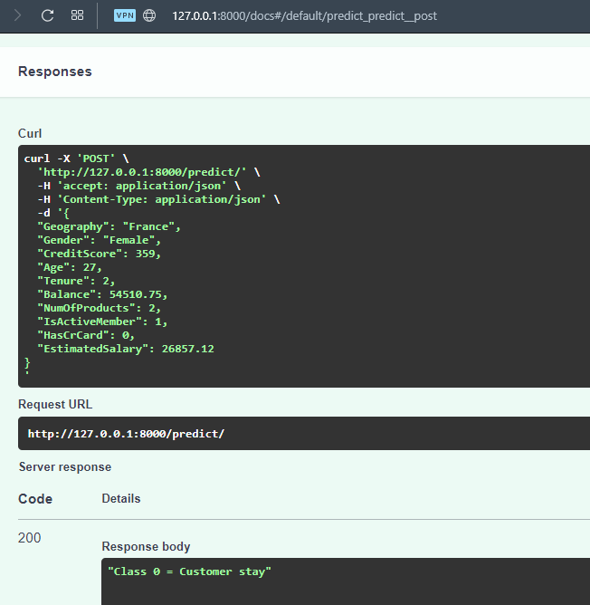
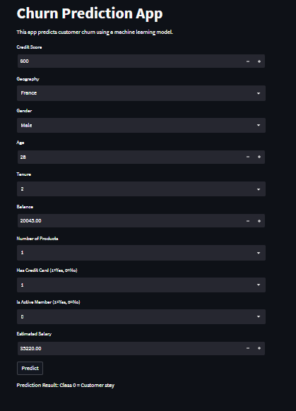

# Churn Prediction for Bank Customers Using Machine Learning 

- `Link Medium` : https://medium.com/@prasetyow938/churn-prediction-for-bank-customers-using-machine-learning-45f604e86dc0
- `Link Youtube` : -

**Selengkapnya dapat diakses pada laman** `docs`

## Cara menjalankan Script Dilokal

### Konfigurasi Awal
- Buat satu folder untuk clone file-file yang tersedia pada laman github ini
- clone repository github ini
- instalasi virtual environment
- aktifkan virtual environment yang telah dibuat
- install requirements.txt dengan cara "pip install -r requirements.txt"
- file sudah dikonfigurasi, lanjutkan step dibawah ini sesuai dengan keinginan

### Cara Menjalankan API

- Pastikan masuk ke folder utama program
- ketik - "uvicorn src.api:app --reload"
- lalu akan dirujuk pada laman `http://127.0.0.1:8000`

### Cara Menjalankan Streamlit
- Pastikan masuk ke folder utama program
- ketik - "streamlit run src/streamlit.py"
- lalu akan diarahkan pada tampilan UI streamlit pada laman `http://localhost:8501/`

### Cara serve MkDocs
- Pastikan sudah berada didalam folder docs
- ketik - mkdocs serve --dev-addr=127.0.0.1:8080
- lalu laman dokumen akan muncul pada laman `http://127.0.0.1:8080`

##  Data Preparation

**Gambar Arsitektur Data Preparation**

#### Dataset Definition

Data yang digunakan merupakan data yang menggambarkan profile nasabah yang menutup rekening dan nasabah yang tetap. adapun fitur profile nasabah yang digunakan antara lain.

Data disadur dari laman
[https://www.kaggle.com/datasets/shantanudhakadd/bank-customer-churn-prediction](https://www.kaggle.com/datasets/shantanudhakadd/bank-customer-churn-prediction)

Data berisi 10000 baris dan 11 kolom yaitu :

- **CreditScore       :
    [int64]
    [350 - 850]
    Skor Kredit yang diukur oleh pihak bank sebagai penilaian terhadap nasabah untuk menggambarkan  risiko kredit seorang calon debitur**

- **Geography         :
    [object]
    ['France', 'Spain', 'Germany']
    Negara asal nasabah**

- **Gender            :
    [object]
    ['male','female']
    Jenis Kelamin nasabah**
    
- **Age               :
    [int64]
    [18 - 92]
    Jenis Kelamin nasabah**

- **Tenure            :
    [int64]
    [0 - 10]
    Jumlah tahun kepesertaan nasabah**

- **Balance            :
    [float64]
    [0.0 - 250898.09]
    Saldo bank nasabah**

- **NumOfProducts      :
    [int64]
    [1, 3, 2, 4]
    Jumlah produk bank yang digunakan nasabah**

- **HasCrCard           :
    [int64]
    [0 - 1]
    apakah nasabah memegang kartu kredit dengan bank atau tidak**.

- **IsActiveMember      :
  [int64]
  [0 - 1]
  apakah nasabah adalah anggota aktif di bank atau tidak**.

- **EstimatedSalary     :
    [float64]
    [11.58 - 199992.48]
    Perkiraan gaji nasabah dalam Dolar**

- **Exited              :
    [int64]
    [0,1]
    1 jika nasabah menutup rekening dengan bank dan 0 jika nasabah dipertahankan**.
    
## Exploratory Data Analysis (EDA)

**Gambar Arsitektur Exploratory Data Analysis (EDA)**

    

## Data Preprocessing

**Gambar Data Preprocessing**

## Data Modeling

**Gambar Arsitektur Data Modeling**

## Machine Learning Services

**Arsitektur Machine Learning Services**

Selanjutnya, setelah melalui beberapa proses dan model telah di save akan dilanjutkan pada deployment dengan menggunakan API dan Streamlit gambar dibawah ini merupakan contoh mengakses menggunakan ML Services melalui FAST API Swagger UI

Berikut contoh input data yang digunakan untuk mengakses API

Berikut hasil output prediksi dari API services

Agar lebih ramah dalam menggunakannya dan tampilannya lebih powerfull, user disuguhkan dengan apps sederhana yang dibangun dengan menggunakan streamlit services, berikut contoh penggunaannya

User diharapkan mengisi form yang sudah disediakan hingga selesai, jika terdapat kesalahan range dalam input data streamlit akan menampilkan error dibagian mana yang inputnya salah, jika dirasa sudah sesuai kriteria maka klik tombol `predict` dan akan mengelarkan hasil `Prediction Result: Class 0 = Customer stay` dan `Class 1 = Customer churn`

## Referensi

- Mahalekshmi, A., & Chellam, G. H. (2022). Analysis of customer churn prediction using machine 
learning and deep learning algorithms. International Journal of Health Sciences, 6(S1), 11684²11693. 
Jain H, (2021) Machine Learning Models Developed For Telecom Churn Prediction J Comput Eng Inf Technol 10:2 DOI: 10.37532/jceit.2021.10(2).251.
- Muhammad, Nurul & Ismail, S.A. & Kama, Mohd & Mohd Yusop, Othman & Azmi, Azri. (2019). Customer Churn Prediction In Telecommunication Industry Using Machine Learning Classifiers. 1-7. 10.1145/3387168.3387219. 
- Lalwani, P., Mishra, M.K., Chadha, J.S. et al. Customer churn prediction system: a machine learning approach. Computing 104, 271–294 (2022). https://doi.org/10.1007/s00607-021-00908-y

- Materi Pacmann AI
- https://towardsdatascience.com/step-by-step-approach-to-build-your-machine-learning-api-using-fast-api-21bd32f2bbdb
- https://engineering.rappi.com/using-fastapi-to-deploy-machine-learning-models-cd5ed7219ea
- https://towardsdatascience.com/xgboost-theory-and-practice-fb8912930ad6